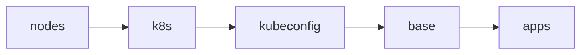

# Bootstrap

Everything needed to take a freshly installed Talos node to a cluster that Flux
manages on its own. The entire process is driven by a single command:

```sh
just bootstrap cluster
```

Once it completes, Flux reconciles the rest of the repository and this
directory is not used again until the next rebuild.

## Prerequisites

- Tools pinned in `.mise/config.toml` installed via `mise install` (talosctl,
  just, minijinja-cli, yq, jq), plus kubectl, helmfile, kustomize, op and gum
  on the PATH (not pinned here).
- A signed-in 1Password CLI (`op`). Machine secrets never live in this repo; every
  `op://` reference in the Talos configs and bootstrap manifests is resolved
  at apply time with `op inject`.
- A valid `talosconfig` at the repo root (mise points `TALOSCONFIG` there).
  The justfile derives the controller endpoint and node list from
  `talosctl config info`, so nothing is hardcoded here.

## Stages

`just bootstrap cluster` runs these stages in order (see [mod.just](mod.just)):



1. **nodes** - Renders each node's Talos config (`talos/*.j2` templates plus
   1Password injection) and applies it with `talosctl apply-config --insecure`.
   Nodes that are already configured are skipped, so the stage is idempotent.
2. **k8s** - Runs `talosctl bootstrap` against the controller, retrying until
   etcd reports the cluster already exists.
3. **kubeconfig** - Fetches the kubeconfig with `talosctl kubeconfig`. The
   cluster endpoint is the node IP, so it works before the CNI is up.
4. **base** - Waits for the apiserver to answer `/readyz` and for the node to
   register (it stays `Ready=False` until the CNI is installed), then applies:
    - `kustomize/` - bootstrap Secrets rendered through `op inject`, plus
      their namespaces: 1Password Connect credentials and token plus the
      Cloudflare tunnel ID (`personal/`). These exist before their
      controllers so nothing deadlocks on a missing Secret.
    - `helmfile/crds.yaml` - CRDs extracted from upstream charts
      (envoy-gateway, grafana-operator, kopiur, kube-prometheus-stack,
      snapshot-controller) and applied directly.
      Installing CRDs out-of-band means Flux Kustomizations that consume
      CRD-backed resources don't need `dependsOn` chains.
5. **apps** - `helmfile sync` of `helmfile/apps.yaml`, the minimal release
   chain Flux needs before it can take over:

    cilium → coredns → cert-manager → external-secrets → onepassword →
    flux-operator → flux-instance

    Once `flux-instance` is healthy, Flux reconciles `kubernetes/` and manages
    these same releases from then on.

> [!TIP]
> Every stage is safe to re-run. If bootstrap fails partway, fix the issue
> and run `just bootstrap cluster` again.

## Data restore (Kopiur)

Bootstrap itself restores no application data; that happens declaratively
once Flux takes over, via [Kopiur](https://github.com/home-operations/kopiur)
(deployed from [kubernetes/apps/kopiur-system/](../kubernetes/apps/kopiur-system/),
backed by the `nas` ClusterRepository: kopia on an NFS share on `nas.internal`).

Apps that opt into the `kopiur/backup` component get a PVC whose
`spec.dataSourceRef` points at a Kopiur `Restore` with `target.populator: {}`
(see [kubernetes/components/kopiur/backup/](../kubernetes/components/kopiur/backup/)).
That makes the `Restore` a passive volume-populator source: when Flux applies
the app on a fresh cluster, the PVC is provisioned by restoring the latest
snapshot for the app's SnapshotPolicy from the repository. The PVC stays
unbound while the restore mover Job runs, so the app's pod simply stays
`Pending` until the data is back; no ordering logic needed anywhere.

Because the `Restore`s use `onMissingSnapshot: Continue`, an app with no
snapshot yet (a brand-new app, or a deliberately fresh start) comes up with
an empty volume instead of failing; the same manifests handle first deploy
and disaster recovery ("deploy-or-restore").

## Single source of truth

The helmfiles define no chart versions or values of their own. Each release's
chart and version are read from the app's `ocirepository.yaml` and its values
from the app's `helmrelease.yaml` under `kubernetes/apps/` (see
[helmfile/templates/](helmfile/templates/)). Bootstrap therefore installs
exactly what Flux will later reconcile, and Renovate updates only one place.
